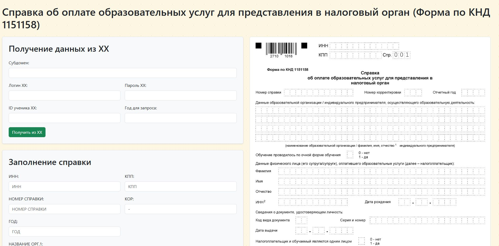

# 📑 Справка об оплате образовательных услуг (FastAPI + PDF)

Приложение на FastAPI для генерации PDF-справок по форме КНД 1151158 с поддержкой заполнения через API и веб-интерфейс.

---

## 🚀 Возможности

- ✅ Заполнение PDF-шаблона на основе данных из веб-формы
- 🔁 Получение данных из внешнего API (CRM HH)
- 💾 Сохранение заполненных значений формы в браузере (`localStorage`)
- 🖼️ Отображение примера справки в правой части интерфейса
- 📥 Скачивание готового PDF

---


---
## ⚙️ Установка и запуск

### 1. Клонирование репозитория

### 2. Создание виртуального окружения
```
python -m venv venv
source venv/bin/activate  # Windows: venv\Scripts\activate
```
### 3. Установка зависимостей
```
pip install -r requirements.txt
```
### 4. Создание .env файла
Опционально, стандартные настройки для локального запуска уже в app/settings.py
```
HOST=127.0.0.1
PORT=8000
RELOAD=True
STATIC_DIR=static
TEMPLATE_PATH=static/template.pdf
```
### 5. Запуск
```
uvicorn app.app:app --reload
Доступен на указаном в .env хосте или по умолчанию на http://localhost:8000
```
### Запуск в Docker
```
# Сборка образа
docker build -t edu-pdf .

# Запуск контейнера
docker run --name edu-pdf-container -p 8000:8000 --env-file .env edu-pdf

# Остановка контейнера
docker stop edu-pdf-container
```
### Пример API запроса для генерации справки
```
POST /fill_pdf/
Content-Type: application/json

{
  "org_inn": "1234567890",
  "org_kpp": "987654321",
  "doc_number": "A-001",
  "correction_number": "01",
  "year": "2025",
  "org_name_1": "ООО Образование",
  "org_name_2": "Дополнительная строка 2",
  "org_name_3": "Дополнительная строка 3",
  "org_name_4": "Дополнительная строка 4",
  "education_form": "0",
  "payer_last_name": "Иванов",
  "payer_first_name": "Иван",
  "payer_middle_name": "Иванович",
  "payer_inn": "123456789012",
  "payer_birth_day": "15",
  "payer_birth_month": "06",
  "payer_birth_year": "1990",
  "payer_doc_type": "21",
  "payer_doc_series": "4510 123456",
  "payer_doc_issue_day": "10",
  "payer_doc_issue_month": "05",
  "payer_doc_issue_year": "2010",
  "same_person": "0",
  "amount_rub": "15000",
  "amount_kop": "50",
  "org_head_last_name": "Петров",
  "org_head_first_name": "Петр",
  "org_head_middle_name": "Петрович",
  "doc_day": "24",
  "doc_month": "04",
  "doc_year": "2025",
  "pages_count": "2",
  "student_last_name": "Петров",
  "student_first_name": "Алексей",
  "student_middle_name": "Петрович",
  "student_inn": "987654321098",
  "student_birth_day": "01",
  "student_birth_month": "09",
  "student_birth_year": "2010",
  "student_doc_type": "03",
  "student_doc_series": "VIII-123456",
  "student_doc_issue_day": "01",
  "student_doc_issue_month": "10",
  "student_doc_issue_year": "2010",
  "doc_date": "2025-04-24"
}
```

### 🗂️ Структура проекта


```
├── app/                    # Основной код приложения (FastAPI)
│   ├── app.py               # Точка входа FastAPI-приложения (создание объекта app, настройка рутов)
│   ├── handlers.py          # Обработчики маршрутов и заполнение PDF
│   ├── settings.py          # Загрузка и хранение конфигураций из .env файла
│   └── tools.py             # Вспомогательные функции (парсинг дат)
│
├── static/                  # Статические файлы
│   ├── index.html           # Главная HTML-страница
│   ├── template.pdf         # Шаблон PDF-файла для заполнения
│   ├── template_Page_1.png  # Превью 1-й страницы справки
│   └── template_Page_2.png  # Превью 2-й страницы справки
│
├── .env.example             # Пример настроек окружения
├── .flake8                  # Конфигурация проверки стиля кода с помощью flake8
├── Dockerfile               # Скрипт для сборки Docker-образа
├── README.md                # Сейчас вы здесь
└── requirements.txt         # Список зависимостей Python
```

### Misc
Проверка кода
```
black . --check       # Проверка соответствия автоформаттеру Black
isort . --check-only  # Проверка правильной сортировки импортов
flake8 .              # Проверка по PEP8 и на частые ошибки
```